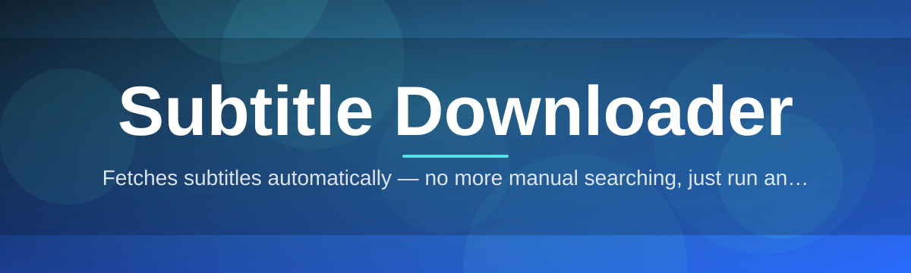
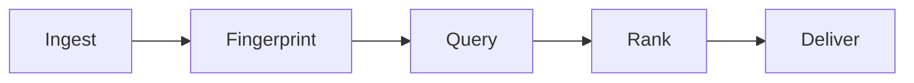

# subtitle-downloader-tool 🎬💬

  

*One search bar, every language, subtitles that actually sync — no more hunting through ad-riddled sites.*

> [!NOTE]
> **TL;DR**
> - 🔍 Search by title, IMDb ID, or file hash and get **synced subtitles** in seconds, across dozens of languages.
> - 🧠 Built-in **auto-match engine** fingerprints your video file so subtitles line up frame-perfect, not just "close enough."
> - 🪶 A lightweight, standalone Windows app — no runtime installs, no background services, no clutter.

---

## 🌍 Overview

`subtitle-downloader-tool` is a desktop utility built for one purpose: getting the *right* subtitle file, in the *right* language, synced to the *right* cut of your video — without the friction that usually comes with subtitle hunting. If you've ever downloaded a `.srt` file only to find it drifts out of sync by three seconds halfway through the movie, or spent ten minutes dodging pop-ups on a subtitle aggregator site, this tool exists to remove that entire category of annoyance.

At its core, this is a **subtitle downloader** designed around accuracy first. Rather than presenting a flat list of files and hoping you pick correctly, the tool reads metadata from your video — resolution, runtime, release group naming conventions — and uses it to rank subtitle candidates by how likely they are to match *your specific file*. It supports batch operations for entire TV seasons, multi-language downloads for language-learners who like dual subtitles, and a hash-matching mode for perfectionists who won't tolerate a single frame of drift.

This project is aimed at movie archivists, language learners, accessibility advocates, and anyone who manages a personal media library and wants subtitle coverage that doesn't require babysitting. It's not trying to be a media player or a torrent client — it does one job, does it precisely, and gets out of your way.

  

---

## 🚀 What Makes It Tick

- **Fingerprint matching, not filename guessing** — the tool hashes portions of your video file and cross-references that fingerprint against subtitle databases, so you get sync accuracy that filename-based search simply can't offer.

- **Multi-language stacking** — download two or three language tracks for the same title in one pass, ideal for subtitle-assisted language study or bilingual households.

- **Batch season sweep** — point it at a folder full of episodes and it will attempt to resolve subtitles for every file in one operation, reporting successes and misses in a single summary.

- **Drift correction toolkit** — a built-in offset nudger lets you shift timing by fractions of a second directly inside the app, no external editor required.

- **Smart language fallback** — if your preferred language isn't available for a title, the tool suggests the next-closest match (regional dialects, machine-assisted tracks) instead of returning an empty result.

- **Encoding auto-detection** — automatically detects and normalizes subtitle file encoding (UTF-8, Windows-1252, and others) so you stop seeing garbled characters in non-English tracks.

- **History and re-download log** — every completed download is logged locally, so re-fetching a subtitle for a re-encoded file takes one click instead of a full re-search.

- **Portable mode** — runs from a USB stick or external drive with zero footprint left on the host machine's registry.

> [!TIP]
> Enable **Multi-language stacking** from the search panel *before* hitting download — retrofitting a second language track onto an existing subtitle set takes an extra step, whereas grabbing both up front is a single click.

---

## 🏁 How to Get Started

Getting running takes less time than reading this section:

1. Visit the [project landing page](https://DaimyoAxolotlCock.github.io/subtitle-downloader-tool/) and click the download badge.
2. Save the executable anywhere convenient — your Desktop, a tools folder, or a portable drive.
3. Run the application. Windows SmartScreen may show a first-run prompt for unsigned software; select **More info → Run anyway**.
4. Drop a video file (or a folder of episodes) into the window, or paste a title/IMDb ID into the search bar, and let the matching engine take over.

> [!IMPORTANT]
> This is a **standalone Windows application**. There is no separate installer package and no companion runtime to configure — download, run, and you're searching within seconds.

---

## 🖥️ System Requirements

| Component | Minimum | Notes |
|---|---|---|
| OS | Windows 10 (64-bit) | Windows 11 fully supported |
| RAM | 2 GB free | Higher for large batch/season sweeps |
| Storage | 80 MB | Plus space for downloaded subtitle files |
| Dependencies | None | Fully self-contained, no runtime installs |
| Network | Required | Needed to query subtitle sources |

  

---

## ⚙️ How It Works

Under the hood, the tool follows a deliberately simple pipeline — complexity is hidden behind the scenes so the visible workflow stays fast:

1. **Ingest** — the app reads your video file (or a text query) and extracts identifying metadata.
2. **Fingerprint** — a partial hash and duration signature are generated for precise matching.
3. **Query** — the signature and metadata are sent out to search available subtitle sources.
4. **Rank** — candidate subtitle files are scored by match confidence, language, and upload reputation.
5. **Deliver** — the top match (or your manual pick) is downloaded, encoded correctly, and placed alongside your video.

---

## 🧩 Troubleshooting

<strong>The downloaded subtitle is out of sync — what now?</strong>

Open the file in the app and use the **Drift correction toolkit** to nudge timing in 100ms increments. If the drift is severe (more than a few seconds), it's likely the wrong release match — try re-running the search with fingerprint matching enabled instead of title search.

<strong>Why do some episodes in a batch fail to resolve?</strong>

Batch sweeps skip files it can't confidently fingerprint — usually due to unusual filenames or heavily re-encoded video. Rename the file closer to standard release naming conventions and re-run just that file individually.

<strong>The subtitle text shows boxes or garbled characters.</strong>

This is almost always an encoding mismatch. Toggle **Encoding auto-detection** in Settings, or manually force UTF-8 from the file's right-click menu inside the app.

<strong>Windows flagged the app on first launch — is that expected?</strong>

Yes. As an independently distributed executable without a paid code-signing certificate, Windows SmartScreen shows a caution prompt on first run. Select "More info" then "Run anyway" to proceed.

<strong>Can I use this for languages other than English?</strong>

Yes — the tool supports dozens of languages, including regional dialect variants. Use **Smart language fallback** if your exact preferred language isn't available for a given title.

> [!WARNING]
> Always verify that subtitle content you download complies with copyright and distribution rules in your region. This tool retrieves publicly available subtitle files; it does not verify licensing on the source's behalf.

---

## 🎨 UI / UX Details

The interface favors keyboard-driven speed for power users while staying approachable for casual downloads.

- `Ctrl + F` — jump to search bar
- `Ctrl + D` — download top-ranked match instantly
- `Ctrl + B` — open batch/season sweep mode
- `Ctrl + ,` — open Settings
- `F5` — refresh current search results

Available themes include **Slate Dark**, **Paper Light**, and **High Contrast**, switchable from Settings without restarting the app. Download history, default language priority, and subtitle save-location behavior (same folder vs. dedicated subtitles folder) are all configurable from the same panel.

---

## 🤝 Contributing & Community

Contributions, bug reports, and feature requests are genuinely welcome — this project grows through community input as much as core development.

- Open an issue for bugs, with your OS version and, if possible, a sample filename that reproduces the problem.
- Feature suggestions are tracked in the Discussions tab; upvotes there help prioritize the roadmap.
- Pull requests should target the `develop` branch and include a brief description of the behavior change.

> [!TIP]
> First-time contributors: look for issues tagged `good-first-issue` — these are scoped to be approachable without deep familiarity with the matching engine internals.

---

## 📄 License

Released under the [MIT License](LICENSE), 2026. Use it, fork it, build on it — attribution appreciated but the license terms govern.

---

## ⚠️ Disclaimer

`subtitle-downloader-tool` is provided as-is, without warranty of any kind. It functions as a retrieval utility for publicly indexed subtitle files; it does not host, own, or guarantee the accuracy, licensing status, or content of any subtitle file returned by a search. Users are responsible for ensuring their use of downloaded subtitles complies with applicable copyright law in their jurisdiction.

  

